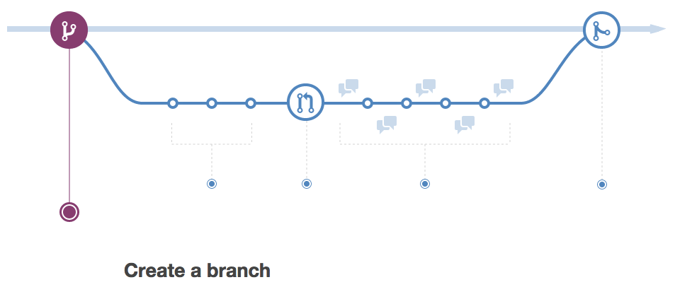
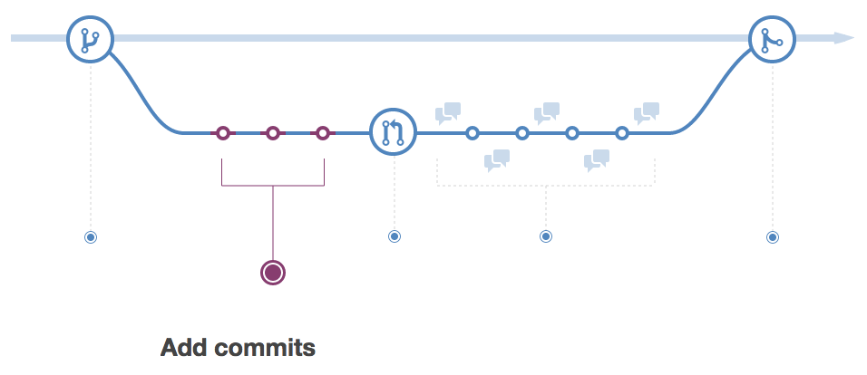
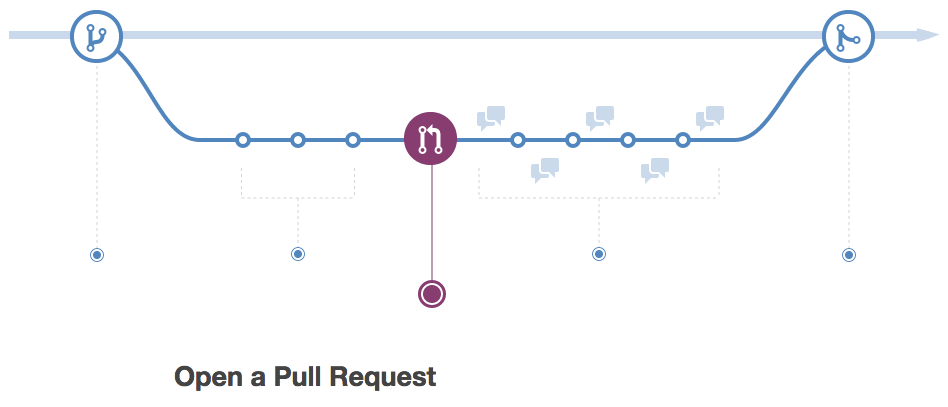
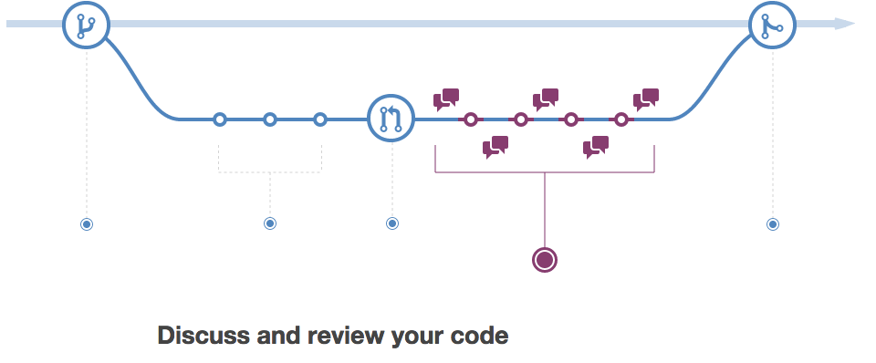
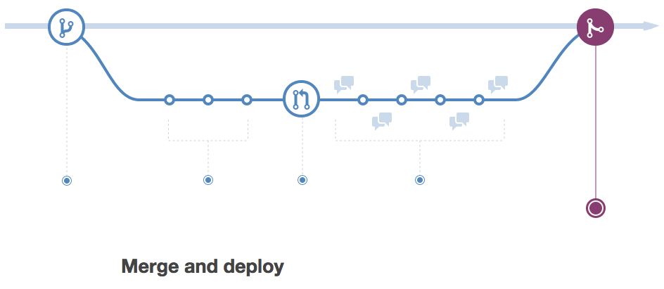

# The Evolution of Social Coding

----
# The Patching Workflow

# Working with Whole Ideas

- Bisect
- Rebasing

----
# Social Coding

# Understanding the GitHub Flow

Source: https://guides.github.com/introduction/flow/

## Create Branch

Source: https://guides.github.com/introduction/flow/

## Make Commits

Source: https://guides.github.com/introduction/flow/

## Open Pull Request

Source: https://guides.github.com/introduction/flow/

## Discuss

Source: https://guides.github.com/introduction/flow/

## Merge Completed Work

Source: https://guides.github.com/introduction/flow/

----
# Visualizing Branches in Git

# Visualizing Branches in Bazaar 

----
# Work-Arounds

1. Rebase branches to collapse all commits before merging (and
   sacrifice ease-of-use).
2. Enforce better commit messages which incorporate the
   conversations from the review process.

# Fixing the "Problem"

1. Improve Git to allow branch-based bisecting.
2. Improve the ability to customise the default commit message (to add
   a template).

----
# Resources

- www.gitforteams.com
- [The Evolution of Social
  Coding](http://gitforteams.com/resources/evolution-social-coding.html)
- slides: www.github.com/emmajane/social-coding
